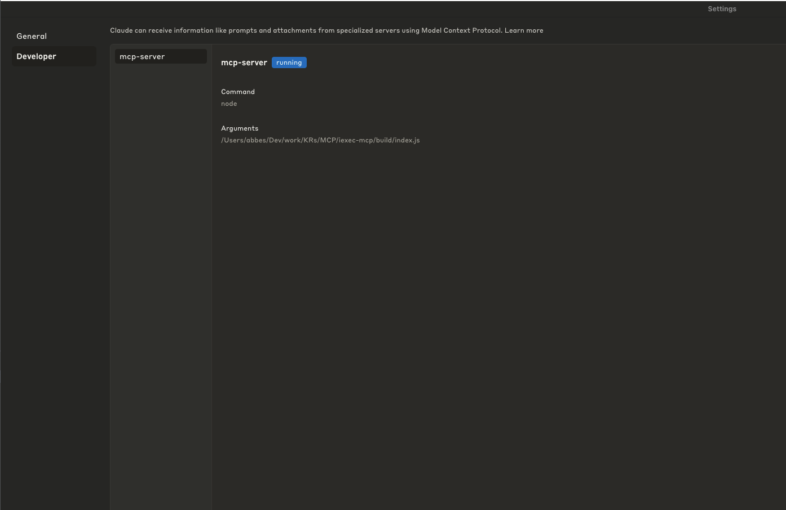
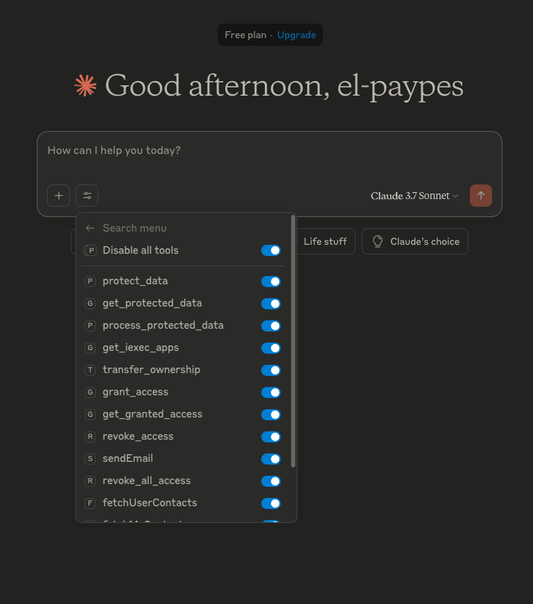

# 🧠 iExec MCP Server

> A [Model Context Protocol (MCP)](https://github.com/anthropics/model-context-protocol) compatible server to interact with the [iExec](https://iex.ec) protocol — built for Claude, agents, and AI tooling.

---

## 🚀 Quickstart

Here’s how to get started with the iExec MCP server locally:

```bash
git clone https://github.com/iexec-blockchain-computing/iexec-mcp-server.git
cd iexec-mcp-server
npm install
npm run build
```

Copy the absolute path of the generated `build/index.js` file. You will need to add this to Claude desktop client config.

---

## ⚙️ Configuring Claude Desktop Client

The easiest way to test your MCP server is to use the **Claude Desktop** client.

1. Open the settings of your Claude desktop client.
2. Navigate to **Developer > Edit Config**.



3. Click `Edit Config`. A file picker will appear — choose the file named `claude_desktop_config.json`.

4. Add the following lines to the file to connect your iExec MCP server:

```json
{
  "mcpServers": {
    "iexec-mcp-server": {
      "command": "node",
      "args": ["/absolute/path/to/iexec-mcp-server/build/index.js"]
    }
  }
}
```

> ✅ **Important:** Replace `/absolute/path/to/...` with the actual absolute path to your `index.js` file in the build folder.

5. Restart Claude Desktop. A new plug icon should appear for the `iexec-mcp-server`.



You can now start using tools from your local MCP server directly in Claude chats.

---

## 🛠️ Available Tools

This MCP server provides a rich toolbox to interact with iExec’s decentralized infrastructure:

### 🧪 Confidential Data & Compute

- `protectData`: Protect a file and publish it via iExec DataProtector
- `getProtectedData`: List your protected datasets
- `processProtectedData`: Compute on protected datasets

### 🛡️ Data Governance

- `grantAccess`: Grant access to a data asset
- `revokeOneAccess`: Revoke one access
- `revokeAllAccess`: Revoke all access to a dataset
- `transferOwnership`: Transfer asset ownership
- `getGrantedAccess`: List granted accesses

### 📬 Messaging via Web3Mail

- `sendEmail`: Send a decentralized message
- `fetchMyContacts`: Get your own contact list
- `fetchUserContacts`: Fetch another user’s contacts

### 💳 Wallet & Resources

- `getUserVoucher`: Check available vouchers
- `getWalletBalance`: Query token balances
- `getIExecApps`: List available apps on iExec marketplace

A full list of tools and parameters is available in [`TOOLS.md`](./TOOLS.md) _(optional, create if needed)_.

---

## ✨ Example Prompts

These are example prompts to test your tools from Claude:

---

## 🔐 Protect My Email Address

**Prompt:**

> "Please protect my email address `alice.example@email.com` using iExec DataProtector. Use my wallet address `0x123...` to handle any necessary top-up."

---

## 📥 Retrieve My Protected Data

**Prompt:**

> "Retrieve the protected data associated with my wallet address `0x1234567890abcdef1234567890abcdef12345678`."

---

## 📨 Grant Web3mail Access to Another User

**Prompt:**

> Grant access to protected data `0x123` for app `web3mail` and user `0xUSER` using my private key

---

## ❌ Revoke a User’s Access to My Data

**Prompt:**

> "Revoke access to protected data `0x123` for app `web3mail` and user `0xUSER`. Here's my private key."

---

## ❌ Revoke a User’s Access to My Data

**Prompt:**

> "Revoke all access previously granted for protected data `0x123`."

## 🔄 Transfer Ownership of Protected Data

**Prompt:**

> "Transfer the ownership of the protected data `0x123` to the address `0x456`."

---

## 📬 Send a Web3mail

**Prompt:**

> "Send an email via Web3mail to `0xrecipientaddress123...` with the subject `Data Access Update` and message `Hello, your request to access the protected data has been approved.`"

---

## 👥 Fetch My Web3mail Contacts

**Prompt:**

> "List all my Web3mail contacts stored with my wallet."

---

## 💸 Get My Wallet Balance

**Prompt:**

> "What’s my current wallet balance on iExec? My wallet address is `0x123...`."

---

## 🎛️ List Available iExec Apps

**Prompt:**

> "List all available iExec applications I can use for processing protected data."

---

## 🎟️ Check for User Voucher

**Prompt:**

> "Do I currently have a user voucher to pay for iExec tasks?"

---

## 🧪 Process Protected Data with iExec App

**Prompt:**

> "Run the iExec application `0X-analyze-data-app` on my protected dataset `0x123`."

---

## 🔒 Security Considerations

- This MCP server is intended to be run locally.
- No private key is exposed to Claude or the LLM.
- You are responsible for managing secrets (e.g. iExec wallet keys, protected data) via secure environments.

---

## 👩‍💻 Contributing

Contributions and feedback are welcome!

- Fork this repo and open a pull request
- Or open an issue to suggest improvements

---

## 📬 Contact

- Join us on [Discord](https://discord.gg/iexec)
- Read the full [iExec Developer Docs](https://docs.iex.ec)
- Learn about [Model Context Protocol (MCP)](https://github.com/modelcontextprotocol)

---

## 🧪 Dev Notes

To test MCP server locally with logs:

```bash
NODE_ENV=dev node build/index.js
```

To add or edit tools:

```
./tools/dataProtectorCore/*.js
./tools/web3mail/*.js
./tools/getIExecApps.js
```

---
