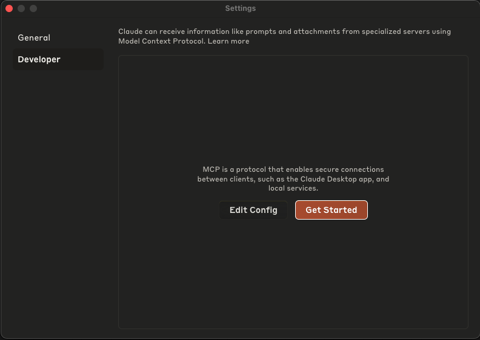
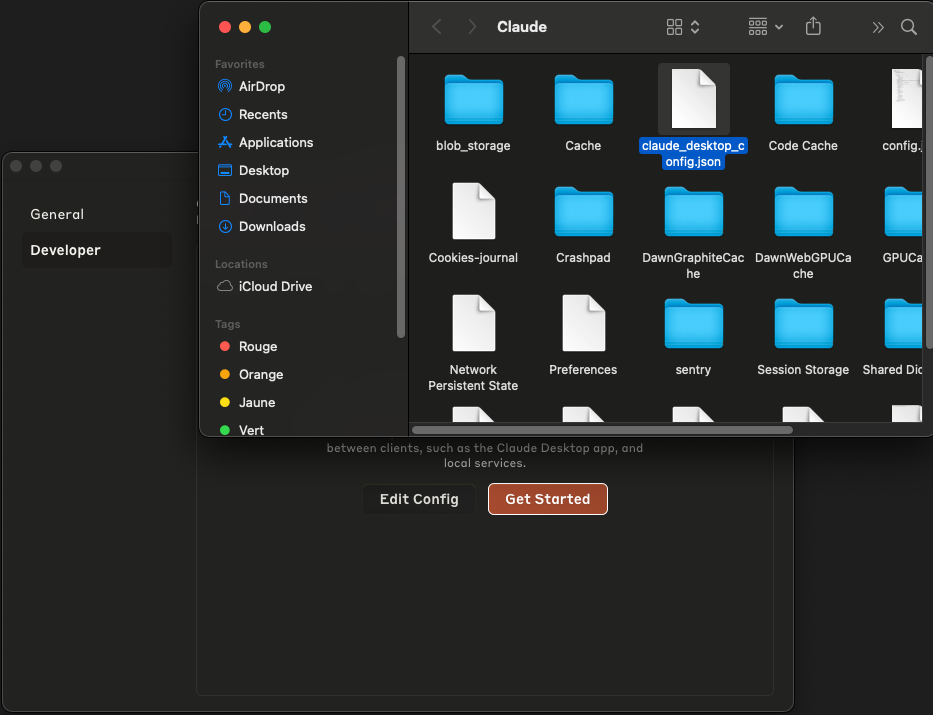
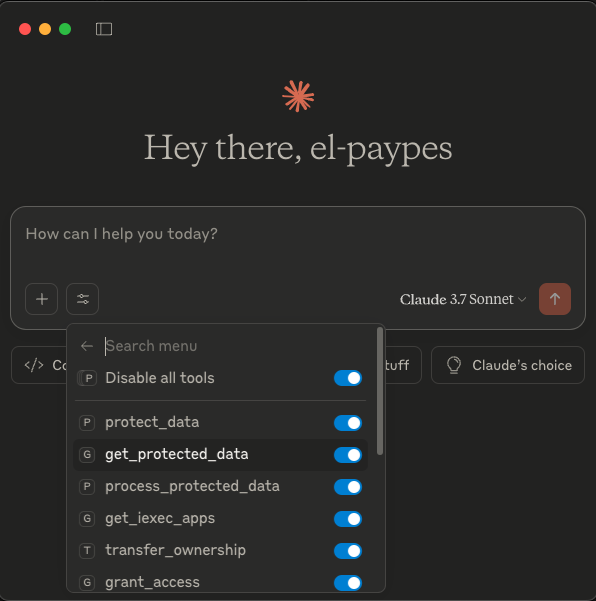

# iExec MCP Server

> A [Model Context Protocol (MCP)](https://github.com/anthropics/model-context-protocol) compatible server to interact with the [iExec](https://iex.ec) protocol — built for Claude, agents, and AI tooling.

## ⚠️ Important

Some MCP tools require signing blockchain transactions, which means you’ll need to provide your private key.

To enable signing, create a `.env` file at the project root by copying the example:

```bash
cp .env.example .env
```

Then edit `.env` and replace the placeholder with your private key:

```bash
PRIVATE_KEY=your_private_key_here
```

🔒 Your private key stays local and secure.  
✅ The `.env` file is in `.gitignore` and won’t be committed.

## 🚀 Quickstart

Follow these steps to set up and run the iExec MCP server locally:

```bash
git clone https://github.com/iexec-blockchain-computing/iexec-mcp-server.git
cd iexec-mcp-server
npm install
npm run build

```

After building, locate the generated `build/index.js` file and copy its absolute path — you’ll need it to configure the Claude Desktop client.

> 💡 **Tip:**
>
> - On **macOS/Linux**: run `realpath build/index.js` to get the absolute path
> - On **Windows (PowerShell)**: run `Get-Item build/index.js | Resolve-Path`

---

## ⚙️ Configuring Claude Desktop Client

The easiest way to test your MCP server is to use the **Claude Desktop** client.

1. Open the settings of your Claude desktop client.
2. Navigate to **Developer > Edit Config**.



3. Choose the file: `claude_desktop_config.json`
   
4. Add your MCP server entry:

```json
{
  "mcpServers": {
    "iexec-mcp-server": {
      "command": "node",
      "args": ["/absolute/path/to/iexec-mcp-server/build/index.js"]
    }
  }
}
```

> ✅ **Important:** Replace `/absolute/path/to/...` with the actual absolute path to your `index.js` file in the build folder.

5. Restart Claude Desktop. A new plug icon should appear for the `iexec-mcp-server`.



You can now start using tools from your local MCP server directly in Claude chats.

---

## 🛠️ Available Tools

### 🔐 Confidential Data

- `protectData`: Encrypt and publish JSON data as a protectedData NFT using iExec DataProtector.
- `getProtectedData`: List all protected data for a given owner, data schema, or both.
- `processProtectedData`: Allows processing a protected dataset through use of a specified iExec application.

### 🛡️ Data Governance

- `grantAccess`: Authorizes a user and app to securely process a protected data.
- `revokeOneAccess`: Removes access rights to a specific protected data for a given user and app.
- `revokeAllAccess`: Remove all granted access permissions for a specific protected dataset.

- `transferOwnership`: Change the ownership of a protected data asset to another wallet address.

- `getGrantedAccess`: Retrieve the list of users and apps currently authorized to access a protected

### 📬 Web3Mail

- `sendEmail`: Send a message to a user via Web3mail without knowing their email, using a protected and authorized data asset.
- `fetchMyContacts`: Retrieve a list of users who authorized you to send them emails, along with their protected email data references.

- `fetchUserContacts`: Retrieves contacts who have authorized a user to send them Web3Mail emails.

### 💳 Wallet & Resources

- `getUserVoucher`, `getWalletBalance`, `getIExecApps`

A full list of tools and parameters is available in [`TOOLS.md`](./TOOLS.md) _(optional, create if needed)_.

---

## ✨ Example Prompts

These are example prompts to test your tools from Claude:

---

## 🔐 Protect My Email Address

**Prompt:**

> "Please protect my email address `alice.example@gmail.com` with the name "iexec-mcp-email-demo" using iExec DataProtector."

---

## 📥 Retrieve My Protected Data

**Prompt:**

> "List all protected data tied to my wallet with full details."

---

## 📨 Grant Web3mail Access to Another User

**Prompt:**

> Grant access to protected data `0x123` for iExec app `web3mail` and user `0xUSER`.

---

## ❌ Revoke a User’s Access to My Data

**Prompt:**

> "Revoke access to protected data `0x123` for app `web3mail` and user `0xUSER`."

---

## ❌ Revoke a User’s Access to My Data

**Prompt:**

> "Revoke all access previously granted for protected data `0x123`."

## 🔄 Transfer Ownership of Protected Data

**Prompt:**

> "Transfer the ownership of the protected data `0x123` to the address `0x456`."

---

## 📬 Send a Web3mail

**Prompt:**

> "Send an email via Web3mail to `0xrecipientaddress123...` with the subject `Data Access Update` and message `Hello, your request to access the protected data has been approved.`"

---

## 👥 Fetch My Web3mail Contacts

**Prompt:**

> "List all my Web3mail contacts stored with my wallet."

---

## 💸 Get My Wallet Balance

**Prompt:**

> "What’s my current wallet balance on iExec? My wallet address is `0x123...`."

---

## 🎛️ List Available iExec Apps

**Prompt:**

> "List all available iExec applications I can use for processing protected data."

---

## 🎟️ Check for User Voucher

**Prompt:**

> "Do I currently have a user voucher to pay for iExec tasks?"

---

## 🧪 Process Protected Data with iExec App

**List available iExec apps**

> "Show available apps for data processing."

**Prompt:**

> "Run the iExec application `0X-analyze-data-app` on my protected dataset `0x123`."

---

## 🛡️ Security Considerations

- This server runs **locally** — no data leaves your machine.
- Secrets like private keys stay in your secure environment.
- Claude and other agents **don't access your keys or data**.

## 👩‍💻 Contributing

Contributions and feedback are welcome!

- Fork this repo and open a pull request
- Or open an issue to suggest improvements

## 📬 Contact & Resources

- [iExec Developer Docs](https://docs.iex.ec)
- [Join iExec on Discord](https://discord.iex.ec)
- [About MCP](https://modelcontextprotocol.io/introduction)
